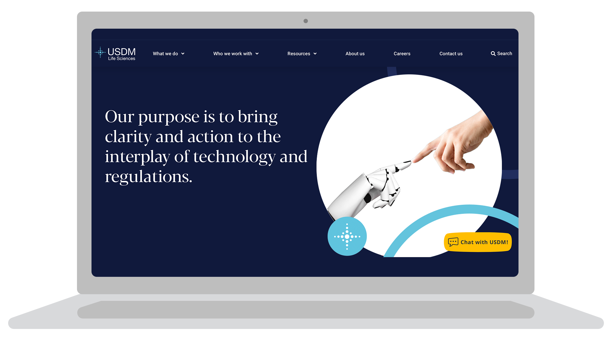

# Move Beyond Data Limitations

## Table of Contents
- [Meaningful Metrics](#meaningful-metrics)
    - [Definition of Vanity and Vanity Metrics](#definition-of-vanity-and-vanity-metrics)
    - [Importance of Actionable Metrics](#importance-of-actionable-metrics)
    - [Four Considerations for Selecting Dashboard Metrics](#four-considerations-for-selecting-dashboard-metrics)

- [How to Identify Key Metrics for a Project](#how-to-identify-key-metrics-for-a-project)
    - [Choosing Your Metrics](#choosing-your-metrics)
    - [An Integrated View](#an-integrated-view)

- [North Star Metrics](#north-star-metrics)
    - [The Guiding Star](#the-guiding-star)
    - [Choosing a North Star Metric](#choosing-a-north-star-metric)
    - [Real North Star Metrics](#real-north-star-metrics)

- [Bridge the Gap from Current State to Ideal State](#bridge-the-gap-from-current-state-to-ideal-state)
    - [Setting Direction with Stakeholders](#setting-direction-with-stakeholders)
    - [Context and Data Quality](#context-and-data-quality)
    - [Building Structures and Systems](#building-structures-and-systems)
    - [Sharing Findings](#sharing-findings)
    - [Acting on Insights](#acting-on-insights)

- [Case Study: USDM - Selecting Key Project Metrics](#case-study-usdm---selecting-key-project-metrics)
    - [Company Background](#company-background)
    - [The Challenge](#the-challenge)
    - [The Approach](#the-approach)
    - [The Results](#the-results)

## Meaningful Metrics
- [Definition of Vanity and Vanity Metrics](#definition-of-vanity-and-vanity-metrics)
- [Importance of Actionable Metrics](#importance-of-actionable-metrics)
- [Four Considerations for Selecting Dashboard Metrics](#four-considerations-for-selecting-dashboard-metrics)

### Definition of Vanity and Vanity Metrics
- “Vanity” can mean excessive pride or something empty and without value.
- Vanity metrics: Impress but lack meaningful insight into actual performance (e.g., social media follower count).

### Importance of Actionable Metrics
- Metrics should be productive, informative, and effective.
- Examples of useful metrics: customer loyalty rate, productivity levels, profits and losses, inventory levels.

### Four Considerations for Selecting Dashboard Metrics
1. Limit Information Overload
    - Include only critical metrics that align with user requirements.
	- Too many or irrelevant metrics can confuse and reduce dashboard value.
2. Align Metrics with Business Objectives
    - Metrics should support specific organizational goals and measure success.
	- Confirm that data availability and analysis processes are in place.
3. Use Clear, Actionable Metrics
    - Avoid vague or overly broad metrics.
	- Use the SMART methodology: Specific, Measurable, Action-oriented, Relevant, Time-bound.
4. Prioritize and Organize Metrics:
	- Display the most important metric prominently at the top.
	- Group related metrics for clarity (e.g., sales, production harvest rates for a farm dashboard).

- Effective Metrics Highlight
    - How the organization is performing.
    - What decision-makers should prioritize.

__Summary__
- Meaningful dashboards focus on relevant, actionable metrics, ensuring they’re never created in vain.

## How to Identify Key Metrics for a Project
- [Choosing Your Metrics](#choosing-your-metrics)
- [An Integrated View](#an-integrated-view)

### Choosing Your Metrics

In this reading, you’re going to consider how choosing the right metrics can determine the success of a project. You’ll do this by exploring an example of a BI professional identifying key metrics for their project.

There are five key points BI professionals take into account when choosing metrics:

1. __The number of metrics__: More information is not always better. BI professionals limit the number of metrics on dashboards to focus specifically on the ones that are key to a project’s success. Key metrics are relevant and actionable. For instance, if metric X drops, is this good or bad? What action would a user take if it dropped that would be different if it rose instead? Too many metrics that aren’t relevant to the project can be confusing and make your dashboard less effective. The goal isn’t to overload the dashboard to account for every single use case, but 80% of the common use cases.
2. __Alignment with business objectives__: Understanding the business objectives can help you narrow down which metrics will support those goals and measure their success. For example, if the business objective is to increase sales, include revenue in your dashboard. You will most likely not want to include a metric such as customer satisfaction because that is not directly related to the business objective of increasing sales.
3. __The necessary technologies and processes__: It’s important to confirm that the necessary technologies and processes are in place for the metrics you’re choosing. If you can’t obtain and analyze the necessary data, then those metrics aren’t going to be very useful.
4. __The cadence of data__: You have to consider how frequently the data becomes available. If a lot of metrics are delivered at a different cadence and frequency, it becomes difficult to schedule a review.
5. __Use SMART methodology__: If you earned your Google Data Analytics Certificate, you know the SMART methodology is a useful tool for creating effective questions to ask stakeholders. It can also be used to identify and refine key metrics by ensuring that they are specific, measurable, action-oriented, relevant, and time-bound. This can help you avoid vague or super-high-level metrics that aren’t useful to stakeholders, and instead create metrics that are precise and informative.

### An Integrated View

In the BI world, data requires a dynamic and thoughtful approach to detect and respond to events as they happen. An integrated view of the whole business is required. In some cases, metrics can be straightforward. For example, revenue is fairly unambiguous: Revenue goes up, and things are going well! But other metrics are a little more complicated.

In an earlier reading, you discovered the importance of context for the CloudIsCool Support team when measuring their ability to effectively answer customer support questions. As a refresher, a customer support ticket was created every time a customer reached out for support. These tickets were addressed by the first response team at CloudIsCool. Sometimes the first response team needed help answering more complex tickets. They would then reach out to the second response team. This was marked as a consult on the support ticket.

Imagine that the BI professionals working with this team now are trying to decide which metrics are useful in a dashboard designed to increase customer satisfaction ratings for support tickets. Perhaps their stakeholders are interested in monitoring consults to ensure that customers are getting the help they need in a timely manner. So the BI team considers adding consult rate, which is the rate at which customer support agents are asking for help from internal experts, as a metric in their dashboard.

Note that an increasing consult rate could be good or bad. It might mean that customer support agents are being more customer-centric and trying to ensure each customer gets the best answer. But it could also mean that agents are being overwhelmed with complaints and having to offload them onto internal experts in order to keep up. Therefore, consult rate is a metric that doesn’t have a clear direction; nor does it have an obvious influence on the decision-making process on its own. So, it’s not a useful metric for this dashboard. Instead, the BI professionals select metrics that indicate success or failure in a more meaningful way. For instance, they might decide to include a metric that tracks when a support agent experiences missing support documentation. This will help leaders decide whether to create more documentation for agents to reference. Notice how this metric has a clear line of action that we can take based on how high or low it is!

__Conclusion__

The ability to choose metrics that inform decision-making and support project success is a key skill for your career as a BI professional. Remember to consider the number of metrics, how they align with your business objectives, the technologies and processes necessary to measure them, and how they adhere to SMART methodology. It’s also important to maintain an integrated view of the entire business and how the information your metrics deliver is used to guide stakeholder action.

## North Star Metrics
- [The Guiding Star](#the-guiding-star)
- [Choosing a North Star Metric](#choosing-a-north-star-metric)
- [Real North Star Metrics](#real-north-star-metrics)

So far, you have been learning about how BI professionals choose the right metrics to measure the success of their projects. BI professionals also use another specific kind of metric to measure the long-term success of the entire business or team; this metric is often referred to as a north star metric. In this reading, you will learn more about north star metrics, how BI professionals choose them, and how they can help a business’s growth over time.

### The Guiding Star

A company’s north star metric goes beyond short-term goals– it’s intended to capture the core measurable value of a business’s product or services over its entire lifetime. These metrics are a guiding light that drive a business forward. That’s why it’s called a north star metric– like the north star can be used to navigate the wilderness, these metrics can be used to navigate business decisions and lead a business to growth.

Having this metric as the guiding light for the entire business is useful in three primary ways:

1. __Cross-team alignment__: Different teams have different specialties and focuses that help a business function. They aren’t always working on the same projects or with the same metrics, which can make it difficult to align across the entire business. A north star metric allows all of the teams to have a consistent goal to focus on, even as they work on different things.
2. __Tracking growth__: It can be difficult to understand and track the growth of an entire organization over time without understanding the driving metrics that determine growth. A north star metric provides a long-term measurable data point that stakeholders can focus on when discussing overall performance and growth in a business.
3. __Focusing values__: A north star metric is primarily a guiding principle for a business– it determines what is important to the organization and stakeholders. This means that choosing the right metric to guide a business can help keep the values in check– whether that’s customer satisfaction, number of customers completing the sales cycle, or customer retention.

### Choosing a North Star Metric

Because north star metrics are so key to a business’s ongoing success, choosing the right metric is a foundational part of a business intelligence strategy. The north star metric has to measure the most essential part or mission of the business. And because every business is different, every business’s north star metric is going to be unique. In order to determine what the most useful north star metric might be, there are a few questions you can ask:

- What is essential to this business’s processes?
- What are the most important KPIs being measured?
- Out of those KPIs, what captures all of the necessary information about this business?
- How can the other metrics be structured around that primary metric?

### Real North Star Metrics

Because more businesses have begun using north star metrics to guide their business strategies, there are a lot of examples of north star metrics in different industries:

- E-commerce:
    - Weekly number of customers completing the sales cycle
    - Value of daily purchases
- Social media:
    - Number of daily active users
    - Messages sent per day
- Streaming and media services:
    - Number of new sign-ups
    - Total reading time
    - Total watching time
    - Monthly subscription revenue
- Hospitality:
    - Number of nights booked
    - Number of repeat customers

These are just a few examples– there are a lot of potential north star metrics for businesses to choose from across a variety of industries, from tech to finance!

__Key takeaways__

As a BI professional, one of your responsibilities will be to empower stakeholders to make business decisions that will promote growth and success over the long term. North star metrics are a great way to measure and guide a business into the future because they allow you to actually measure the success of the entire business, align teams with a single goal, and keep the business’s values at the forefront of their strategy.

## Bridge the Gap from Current State to Ideal State
- [Setting Direction with Stakeholders](#setting-direction-with-stakeholders)
- [Context and Data Quality](#context-and-data-quality)
- [Building Structures and Systems](#building-structures-and-systems)
- [Sharing Findings](#sharing-findings)
- [Acting on Insights](#acting-on-insights)

Business intelligence professionals continually monitor processes and systems to determine if it’s necessary to make updates for greater efficiency and optimization. These professionals explore ways to bring the current state closer to the ideal state. They do this through a process called gap analysis, which is a method for examining and evaluating the current state of a process in order to identify opportunities for improvement in the future.

Gap analysis involves understanding where you currently are compared to where you want to be so that you can bridge the gap. BI uses gap analysis to do all kinds of things, such as improve data delivery systems or create dashboard reports.

For example, perhaps a sales team uses a dashboard to track sales pipeline progress that has a six-hour data lag. They use this dashboard to gather the most up-to-date information as they prepare for important meetings. The six-hour lag is preventing them from accessing and sharing near-real-time insights in stakeholder meetings. Ideally, the delay should be one hour or less.

### Setting Direction with Stakeholders

The first step in bridging the gap is to work with stakeholders to determine the right direction for this BI project. Establishing stakeholder needs and understanding how users are interacting with the data are important for assessing what the ideal state of a system actually is. What needs do stakeholders have that aren’t being met or could be addressed more efficiently? What data is necessary for their decision-making processes? Working closely with stakeholders is necessary to understand what they actually need their BI tools to do.

The BI professionals collect information and learn that, as the company grew, it opened offices across the country. So, the sales teams are now more dispersed. Currently, if a team member from one office updates information about a prospective client, team members from other offices won't get this update until the workday is almost over. So, their goal is to reduce the data delay to enable better cross-team coordination.

### Context and Data Quality

In addition to identifying stakeholder needs, it’s also important for the BI professional to understand the context of the data they interact with and present. As you know, context is the condition in which something exists or happens; it turns raw data into meaningful information by providing the data perspective. This involves defining who collected it or funded its collection; the motivation behind that action; where the data came from; when; the method used to collect it; and what the data could have an impact on. BI professionals also need to consider context when creating tools for users to ensure that stakeholders are able to interpret findings correctly and act on them.

It’s also critical that BI professionals ensure the quality and integrity of the data stakeholders are accessing. If the data is incorrect, the reporting tools won’t be accurate, and stakeholders won’t be able to make appropriate decisions — no matter how much context they have been given.

Now, the sales team's BI professional needs to identify data sources and the update frequency for each source. They discover that most of the key data sources update every 15 minutes. There are a few nonessential data sources that rarely get updated, but the team doesn’t actually have to wait until those data sources are updated to use the pipeline. They’re also able to confirm that the data warehouse team will verify these data sources as being clean and containing no duplicates or null fields that might cause issues.

### Building Structures and Systems

A large part of a BI professional’s job is building structures and systems. This means designing database storage systems, organizing the data, and working with database governance specialists to maintain those systems. It also involves creating pipeline tools that move and transform data automatically throughout the system to get data where it needs to go to be useful.

These structures and systems can keep data organized, accessible, and useful for stakeholders during their decision-making process. This empowers users to access the data they need when they need it — an ideal system should be organized and structured to do just that. To address the sales team’s needs, the BI analyst in this case designs a new workflow through which data sources can be processed simultaneously, cutting down processing time from 6 hours to less than an hour.

### Sharing Findings

If you are coming to this course from the Google Data Analytics Certificate, you may already be familiar with the share stage of the data analysis process. This is the point at which a data analyst creates data visualizations and reports and presents them to stakeholders. BI professionals also need to share findings, but there are some key differences in how they do so. As you have been learning, creating ways for users to access and explore data when they need it is a key part of an ideal BI system. A BI professional creates automated systems to deliver findings to stakeholders or dashboards that monitor incoming data and provide current updates that users can navigate on their own.

In the sales team dashboard example, the final output is a dashboard that sales teams across the country use to track progress in near-real time. In order to make sure the teams are aware of the updates, the team’s BI analyst shares information about these backend improvements, encouraging all sales teams to check the data at the top of the hour before each meeting.

### Acting on Insights

BI focuses on automating processes and information channels in order to transform relevant data into actionable insights that are easily available to decision-makers. These insights guide business decisions and development. But the BI process doesn’t stop there: BI professionals continue to measure those results, monitor data, and make adjustments to the system in order to account for changes or new requests from stakeholders.

After implementing the backend improvements, the sales team also creates system alerts to automatically notify them when data processes lag behind so they're prepared for a data delay. That way, they could know exactly how well the system is working and if it needs to be updated again in the future.

__Conclusion__

A large part of a BI professional's work revolves around identifying how current systems and processes operate, evaluating potential improvements, and implementing them so that the current system is closer to the ideal system state. Throughout this course, you’ll learn how to do that by collaborating with stakeholders, understanding context, maintaining data quality, sharing findings, and acting on insights.

## Case Study: USDM - Selecting Key Project Metrics
- [Company Background](#company-background)
- [The Challenge](#the-challenge)
- [The Approach](#the-approach)
- [The Results](#the-results)

In this part of the course, you have been focusing on how business intelligence professionals identify effective metrics for a project. A key part of this process is working with stakeholders to understand their data needs and how those interests can be measured and represented with the data. In this case study, you will have the opportunity to explore an example of how the BI team at [USDM](https://usdm.com/) worked with stakeholders to develop metrics. 

### Company Background

USDM, headquartered in Santa Barbara, California, collaborates with life science companies across a variety of industries, including biotechnology, pharmaceutical, medical device technology, and clinical. USDM helps its customers, from large-scale companies to small businesses, ensure that their database systems are compliant with industry standards and regulations, and work effectively to meet their needs. USDM’s vision is to bring life sciences and healthcare solutions to the world better and faster—starting with its own company values: customer delight, accountability, integrity, respect, collaboration, and innovation. 

### The Challenge

In this case study, you’re going to explore an example of USDM’s work with one of their clients. The client for this project researches and develops antibody treatments for cancer patients. The client needs analytics that measure the effectiveness and efficiency of their products. However, with the client’s existing database, to get the types of reports they need, they have to access many systems, including facility data, licensing information, and sales and marketing data. All of this data exists in various places, and as a result, developing analysis reports creates issues for the client’s stakeholders. Also, it makes it harder to compare key metrics because so many KPIs needed to be brought together in one place. 

To help better understand how effective their product is and forecast demand, the client asked USDM to help architect a data storage system that could address their specific needs. They needed a system that could bring the data their team needs together, follow industry regulations, and allow them to easily create reports based on key metrics that can be used to measure product effectiveness and market trends. A significant part of this initiative started with the basics: what were the actual key metrics for the client’s team and what data systems did they come from? 

### The Approach

To identify which metrics were most important for the client’s business needs, the USDM team needed to get input from a variety of different people from across the organization. For example, they needed to know what charts the sales and marketing teams who used this data for their reports needed, what their existing processes were, and how to address these needs in the new system. But, they also needed to know what data the product development team used in order to measure efficacy. 

USDM worked closely with different teams to determine what charts they needed for reports, how they were accessing and using the database system currently, and what they were hoping to achieve with the new system. As a result, the team was able to determine a selection of key metrics that represented their client’s business needs. These metrics included:

- Sales performance
- Product performance
- Insurance claims
- Physician information
- Facility data

To enact a business intelligence solution there must be both the business interaction with stakeholders and the technical interaction with the architects of other team’s systems. Once these metrics were identified by the client, the USDM team collaborated with other members of the client’s team to begin building a new solution that could capture these measurements. 

But, almost every project comes with unexpected challenges; the database tool the team was using to develop the new system didn’t have all of the features the team needed to capture their must-have metrics. In this case, the USDM team collaborated with leadership to develop a list of requests from the tool vendor, who was able to address their team’s unique needs. 

### The Results

By the end of the project, the USDM BI team architected a data storage system that consolidated all of the data their team needed from across a variety of sources. The system captured the key metrics the client needed to understand their product’s effectiveness, forecast sales demand, and evaluate marketing strategies. The reporting dashboards created with this data storage system included everything the stakeholders needed. By consolidating all of the KPIs in one place, the system could provide faster insights and save the client time and improve efficiency without having to run reports from every individual system. The solution was more automated and efficient—and importantly, designed specifically with their team’s most useful metrics in mind.

__Conclusion__

Collaborating with users and stakeholders to select metrics early on can help determine the long-term direction of a project, the specific needs stakeholders have, and how to design BI tools to best address unique business needs. As a BI professional, a key part of your role will be considering key metrics and how to tailor the tools and systems you create to capture those measurements efficiently for reporting use.
