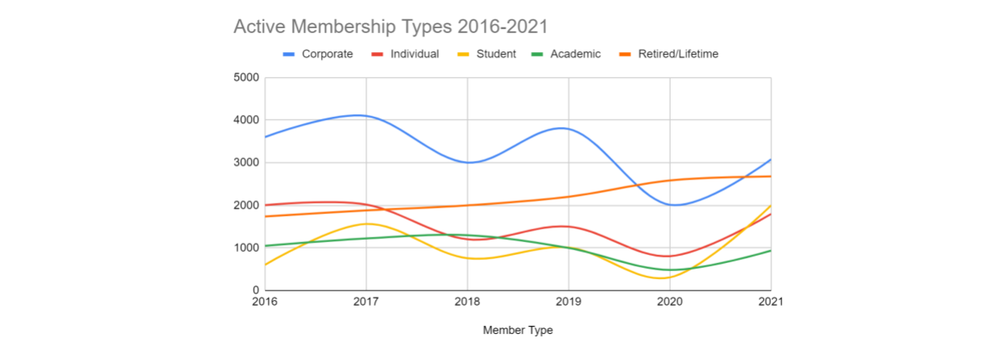

# Constant Change and Other Limitations

## Table of Contents
- [Reexamine the Importance of Context](#reexamine-the-importance-of-context)
    - [Interpreting Line Charts](#importance-of-context)
    - [Importance of Context](#importance-of-context)
    - [Contextualization in BI](#contextualization-in-bi)
    - [Dashboard Example for Finance](#dashboard-example-for-finance)
    - [Cross-functional Consideration](#cross-functional-consideration)
    - [Collaboration through Shared Dashboards](#collaboration-through-shared-dashboards)
    - [Effective Data Presentation](#effective-data-presentation)

- [Why Context is Critical](#why-context-is-critical)
    - [The Scenario](#the-scenario)

- [Data Availability in a World of Constant Change](#data-availability-in-a-world-of-constant-change)
    - [BI Tools and Data Availability](#bi-tools-and-data-availability)
    - [Data Availability Definition](#data-availability-definition)
    - [Realistic Data Quality Goals](#realistic-data-quality-goals)

- [Data Ethics and the Importance of Data Privacy](#data-ethics-and-the-importance-of-data-privacy)
    - [Privacy matters](#privacy-matters)
    - [Protecting privacy with data anonymization](#protecting-privacy-with-data-anonymization)

- [Anticipate Data Limitations](#anticipate-data-limitations)
    - [Factors of data availability](#factors-of-data-availability)
    - [Missing data](#missing-data)
    - [Misaligned data](#misaligned-data)
    - [Dirty data](#dirty-data)

## Reexamine the Importance of Context
- [Interpreting Line Charts](#importance-of-context)
- [Importance of Context](#importance-of-context)
- [Contextualization in BI](#contextualization-in-bi)
- [Dashboard Example for Finance](#dashboard-example-for-finance)
- [Cross-functional Consideration](#cross-functional-consideration)
- [Collaboration through Shared Dashboards](#collaboration-through-shared-dashboards)
- [Effective Data Presentation](#effective-data-presentation)

### Interpreting Line Charts
- Different viewers can interpret charts in varied ways without context.
- Providing titles, legends, and labeled axes clarifies data, reducing misinterpretation.

### Importance of Context
- Contextualizing data transforms raw information into meaningful insights for accurate, data-driven decisions.
- Context helps prevent misinterpretations, saving stakeholders time and ensuring accurate information.

### Contextualization in BI
- In BI, context extends to the design and accessibility of tools, enhancing effective user interaction.
- A centralized, well-designed dashboard allows stakeholders to access necessary data without switching contexts.

### Dashboard Example for Finance
- Example: A finance team analyzes departmental costs. If anomalies (e.g., high operations costs) appear, a well-designed dashboard should allow for further investigation.

### Cross-functional Consideration
- BI work should align with business objectives and consider various user needs and perspectives.
- Designing a universally accessible dashboard enables efficient collaboration and insightful discussions.

### Collaboration through Shared Dashboards
- A single dashboard enables contextual insights from different perspectives (e.g., finance vs. sales).
- This shared tool supports discussions that deepen understanding, with team members contributing relevant insights.

### Effective Data Presentation
- Contextual presentation confirms data relevance, suitability of format, and logical insights, boosting understanding and driving business outcomes.

## Why Context is Critical
- [The Scenario](#the-scenario)

In this lesson, you have been learning about the importance of context in business intelligence. As a refresher, context is the condition in which something exists or happens. For example, in a previous video you considered this data visualization:

This line graph just shows five different lines on a grid, but we don’t have any information about what the lines of the graph represent, how they’re being measured, or what the significance of this visualization is. That’s because this visualization is missing context. Check out the completed version of this visualization:

This visualization has all of the information needed to interpret it. It has a clear title, a legend indicating what the lines on the graph mean, a scale along the y axis, and the range of dates being presented along the x axis. Contextualizing data helps make it more meaningful and useful to your stakeholders and prevents any misinterpretations of the data that might impact their decision-making. And this is true for more than just visualization! In this reading, you’ll explore a business case where context was key to a BI project’s success.

### The Scenario

The CloudIsCool Support team provides support for users of their cloud products. A customer support ticket is created every time a user reaches out for support. A first response team is in charge of addressing these customer support tickets. However, if there is a particularly complex ticket, a member of the first response team can request help from the second response team. This is categorized as a consult within the ticketing system. The analytics team analyzes the ticket and consults data to help improve customer support processes.

Usually, the consultation request is fulfilled successfully and the first response team is able to resolve the customer’s ticket, using guidance from the second response team. However, sometimes even the second response team isn’t able to fully answer the question or new details about the case require additional insight. In that case, the first response team might ask for another consultation, which is labeled as a reconsult.

This is all important context for a BI professional working with stakeholders who are interested in how well current support processes are working and how they might be improved. If they build reporting tables and dashboards that only track consults and not reconsults, they might miss key insights about how effective the consultation system truly is. For example, a high reconsult rate would mean that more cases aren’t being resolved in the first or second attempts. This could lead to customers waiting longer for their issues to be resolved. The leadership would want to evaluate these processes.

Knowing this context, the BI professional working on this project is able to build out appropriate metrics, reporting tables, and the dashboard that tracks that metric in a way that helps stakeholders make informed decisions about this process. By understanding the business context, BI professionals can create more meaningful reports.

__Conclusion__

Context is the who, what, where, when, and why surrounding data that makes it meaningful. Knowing this background information helps us interpret data correctly and visualize useful business intelligence insights for stakeholders. When BI professionals understand the context, choose the right data, and build contextualized visuals to share with stakeholders, they can empower businesses and leadership to make successful decisions.

## Data Availability in a World of Constant Change
- [BI Tools and Data Availability](#bi-tools-and-data-availability)
- [Data Availability Definition](#data-availability-definition)
- [Realistic Data Quality Goals](#realistic-data-quality-goals)

### BI Tools and Data Availability
- Key BI tools
    - data models
    - ETL pipelines
    - visualizations
    - dashboards 

- Success depends on:
    - data being relevant
    - timely
    - consistent
    - bias-free, 
- This known as data availability.

### Data Availability Definition
- Refers to the extent to which timely, relevant information is accessible and usable.
- Challenges to data availability can impact BI solution integrity.
- Challenges Affecting Data Availability:
    1. Integrity Issues:
	    - Data integrity involves accuracy, completeness, consistency, and trustworthiness.
	    - Common issues: duplicates, missing information, inconsistent structure, non-conformance to business rules.
	2. Visibility Challenges:
	    - Data visibility is the ability to identify, monitor, and integrate data from various internal and external sources.
	    - Internal challenges: departments may be unaware of each other’s data.
	    - Solution: collaborate to list data repositories; use interviews or surveys with data owners.
	    - External data (e.g., government datasets, industry surveys) can also enhance BI projects.
	3. Update Frequency:
	    - Different sources may refresh at different intervals (e.g., weekly vs. monthly), leading to outdated insights.
	    - Example: a retail partner relocation impacts monthly sales data accuracy if updates are delayed.
	    - BI professionals must understand update schedules to align insights accurately.
	4. Change Management:
	    - Data availability may shift due to internal changes (e.g., system updates) or external factors (e.g., UI upgrades).
	    - BI professionals need to plan for informing stakeholders about changes that might impact projects.
	    - Encourage team awareness of potential changes and prepare to fill any resulting data gaps.

### Realistic Data Quality Goals
- Acknowledge limitations and constraints in data quality for practicality.
- Strive for “good enough” data quality; perfection is often unachievable and unnecessary.

## Data Ethics and the Importance of Data Privacy
- [Privacy matters](#privacy-matters)
- [Protecting privacy with data anonymization](#protecting-privacy-with-data-anonymization)

Recently, you’ve been learning about the importance of context in business intelligence. You discovered that, when you contextualize, you put something into perspective by considering its origin and other relevant background information; the motivation behind it; the larger setting in which it exists, such as a particular time period; and what it might have an impact on. Contextualization also supports fairness and reduces the chance of bias when your users seek to gain useful insights from the data you’re presenting.

Likewise, as a BI professional, you have a responsibility to treat data ethically. Data ethics refers to well-founded standards of right and wrong that dictate how data is collected, shared, and used. Throughout your career you will work with a lot of data. This sometimes includes PII, or personally identifiable information, which can be used by itself or with other data to track down a person's identity. One element of treating that data ethically is ensuring that the privacy and security of that data is maintained throughout its lifetime. In this reading, you will learn more about the importance of data privacy and some strategies for protecting the privacy of data subjects.

### Privacy matters

Data privacy means preserving a data subject’s information and activity any time a data transaction occurs. This is also called information privacy or data protection. Data privacy is concerned with the access, use, and collection of personal data. For the people whose data is being collected, this means they have the right to:

- Protection from unauthorized access to their private data
- Freedom from inappropriate use of their data
- The right to inspect, update, or correct their data
- Ability to give consent to data collection
- Legal right to access the data

In order to maintain these rights, businesses and organizations have to put privacy measures in place to protect individuals’ data. This is also a matter of trust. The public’s ability to trust companies with personal data is important. It’s what makes people want to use a company’s product, share their information, and more. Trust is a really big responsibility that can’t be taken lightly.

### Protecting privacy with data anonymization

 

Organizations use a lot of different measures to protect the privacy of their data subjects, like incorporating access permissions to ensure that only the people who are supposed to access that information can do so. Another key strategy to maintaining privacy is data anonymization.

Data anonymization is the process of protecting people's private or sensitive data by eliminating PII. Typically, data anonymization involves blanking, hashing, or masking personal information, often by using fixed-length codes to represent data columns, or hiding data with altered values.

Data anonymization is used in just about every industry. As a BI professional, you probably won’t personally be performing anonymization, but it’s useful to understand what kinds of data are often anonymized before you start working with it. This data might include:

- Telephone numbers
- Names
- License plates and license numbers
- Social security numbers
- IP addresses
- Medical records
- Email addresses
- Photographs
- Account numbers

Imagine a world where we all had access to each other’s addresses, account numbers, and other identifiable information. That would invade a lot of people’s privacy and make the world less safe. Data anonymization is one of the ways we can keep data private and secure!

__Key takeaways__

For any professional working with data about actual people, it’s important to consider the safety and privacy of those individuals. That’s why understanding the importance of data privacy and how data that contains PII can be made secure for analysis is so important. We have a responsibility to protect people’s data and the personal information that data might contain.

## Anticipate Data Limitations
- [Factors of data availability](#factors-of-data-availability)
- [Missing data](#missing-data)
- [Misaligned data](#misaligned-data)
- [Dirty data](#dirty-data)

We live in a world where data is constantly being generated. There is so much information out there to learn from. But we also live in a world that is constantly changing, and often the data that we encounter has certain limitations we need to consider as we analyze data and draw insights from it.

### Factors of data availability

Previously, you learned about the importance of data availability, which is the degree or extent to which timely and relevant information is readily accessible and able to be put to use. The factors that influence data availability are:

- Data integrity: The accuracy, completeness, consistency, and trustworthiness of data throughout its life cycle.
- Data visibility: The degree or extent to which information can be identified, monitored, and integrated from disparate internal and external sources.
- Update frequency: How often disparate data sources are being refreshed with new information.
- Change: The process of altering data, either through internal processes or external influence.

Next, you are going to consider the limitations of data that might change the availability and how you can anticipate those limitations as a BI professional.

### Missing data

If you have incomplete or nonexistent data, you might not have enough data to reach a conclusion. Or, you might even be exploring data about a totally different business problem! Understanding what data is available, identifying potential other sources, and filling in the gaps is an important part of the BI process.

### Misaligned data

As a BI professional, you will often use data from different sources. Some of these might be internal sources to the business you’re working with, but they might also include external sources. These sources might define and measure things in completely different ways. In cases like these, establishing how to measure things early on standardizes the data across the board for greater reliability and accuracy. This will make sure comparisons between sources are meaningful and insightful.

### Dirty data

Dirty data refers to data that contains errors. Dirty data can cause errors in your system, inaccurate reports, and poor decision-making. Implementing processes for cleaning data by fixing or removing incorrect, corrupted, incorrectly formatted, duplicate, or incomplete data within a dataset is one way you can prepare for this limitation.

__Conclusion__

As a BI professional, you’ll need to understand that sometimes the data you work with will have limitations. This could mean that it doesn’t fit within a certain time range, or it only applies to specific situations, or there are challenges identifying the data you need. Being able to anticipate those issues and consider them when you build tools and systems for your business will allow you to ensure that those limitations don’t stop your stakeholders from getting the data they need to make great decisions and ensure project success!